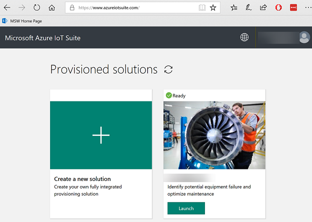
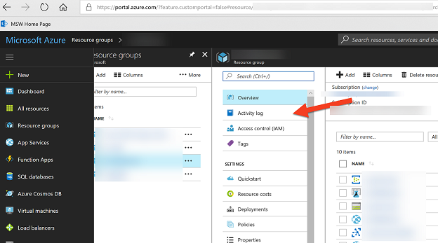
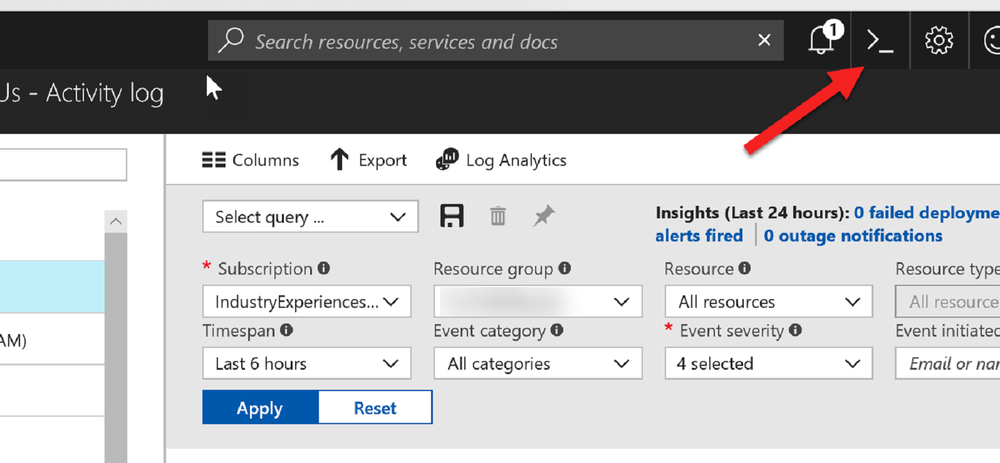

# Deploying IoT PdM solution using ARM templates

In order to expedite this example we started with deploying a solution using the [Azure IoT Suite portal](http://www.azureiotsuite.com) ([www.azureiotsuite.com](www.azureiotsuite.com)).

If you try to deploy a solution using this interface, you may encounter a failure during deployment. One way to see the details of the error is to go to Azure portal at [portal.azure.com](http://portal.azure/), select the resource group (same as your solution name), and look at the "Activity Log" as seen below:

The first deployment on my brand new subscription failed, because the "microsoft.machinelearning" resource provider was not registered on my subscription, and I simply had to go to Azure Cloud Shell

and register the missing resource provider, in my case, it was microsoft.machinelearning.

`Register-AzureRmResourceProvider -ProviderNamespace "microsoft.machinelearning"`

 After the solution is successfully deployed, you can then go to "Automation Script" for the resource group, and export. However, there are some resources you cannot export yet.

 Our goal is not to get you through all of the steps before, and deploy a solution using the AzureIoTSuite.com interface but give you a starting point for deploying the Azure IoT PdM solution using ARM templates.
 
 ## Deploying to Azure Directly
 

