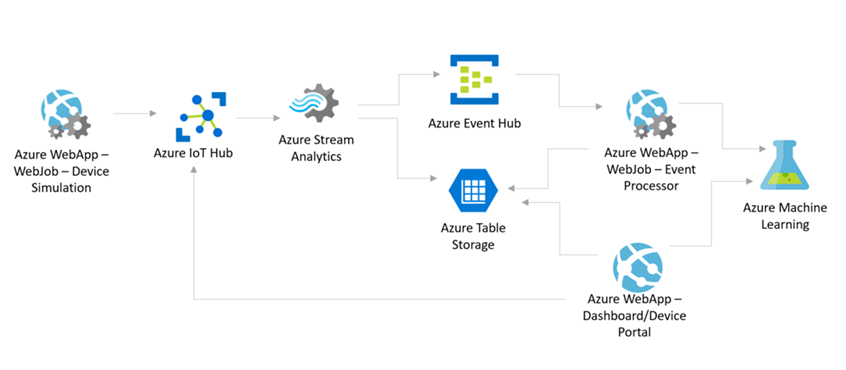

# PdM
## Improvements on the Microsoft IoT Predictive Maintenance Packaged Solution
Microsoft has published a number of packaged solutions demonstrating the use of various Azure services in the context of IoT scenarios. One of those solutions is for the predictive maintenance scenario.

We will be introducing some components and implementations on the existing PdM solution in this repository to demonstrate the Microsoft Azure platform's capabilities.

The solutions are intended to be deployed using a [portal](https://www.azureiotsuite.com/), with the intention of making it easier to deploy them.

We will start with introducing the ARM templates to deploy the PdM solution. The templates are in the [Deploy](./Deploy/README.md) folder.

## Architecture
The Azure IoT Suite documentation provides a high level-view of the architecture [here](https://docs.microsoft.com/en-us/azure/iot-suite/iot-suite-predictive-walkthrough). We will be expanding on the existing documentation.

When you deploy the solution, either through the [www.azureiotsuite.com](https://www.azureiotsuite.com/) or the provided templates, you will end up with the following components deployed.

## Source Code
Source code for the PdM solution can be found [here](https://github.com/Azure/azure-iot-predictive-maintenance)

## Missing Pieces
We are not adding the MSDeploy extension to the web apps, since we see that as a separate step when deploying the code to the App Service.